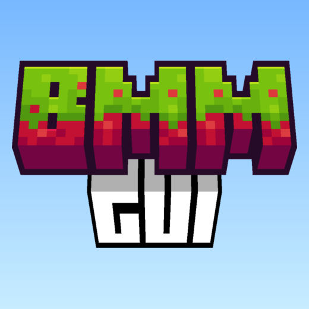

## Better Main Menu GUI
Better Main Menu GUI is a resource pack that extends the gui style of the mod [Better Main Menu.](https://modrinth.com/mod/bettermainmenu)

**Full Credit Goes To  [Mitzingdash](https://github.com/Mitzingdash) For Button Textures!**

> ### Note
> 
> This Pack Is Built For 1.21-latest

## Images

Singleplayer Screen

Multiplayer Screen

Options Menu

